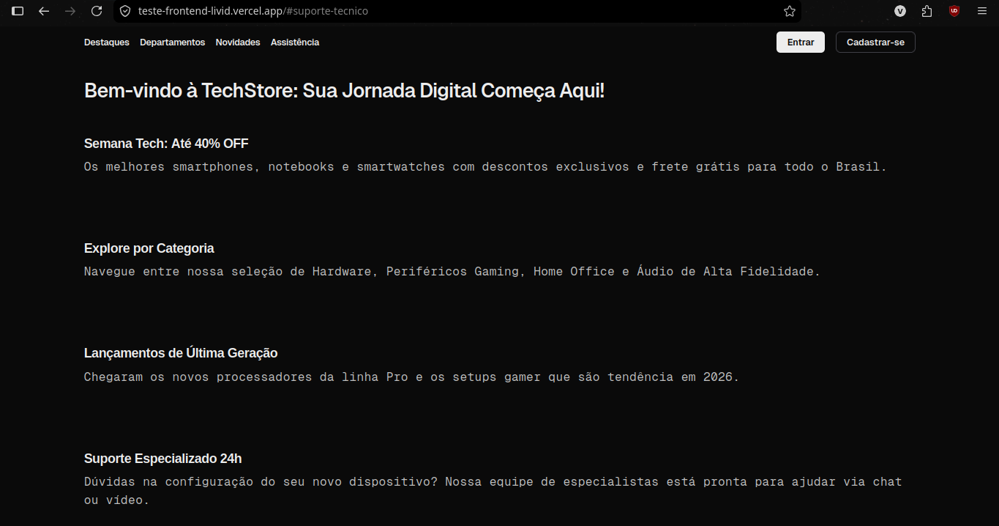
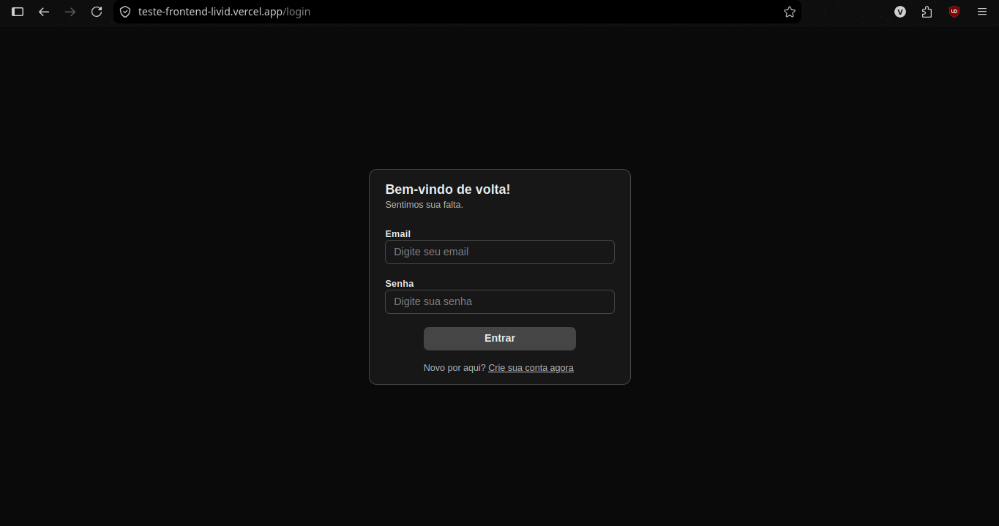
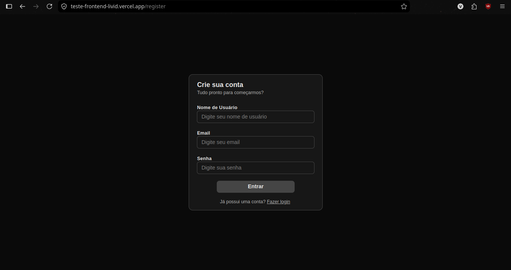
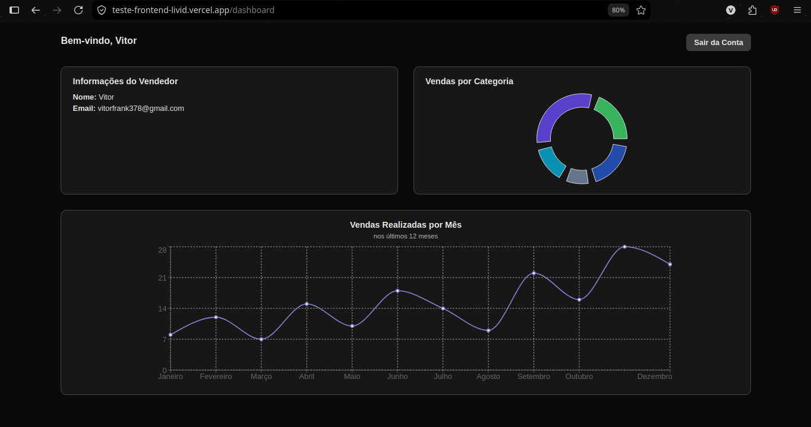
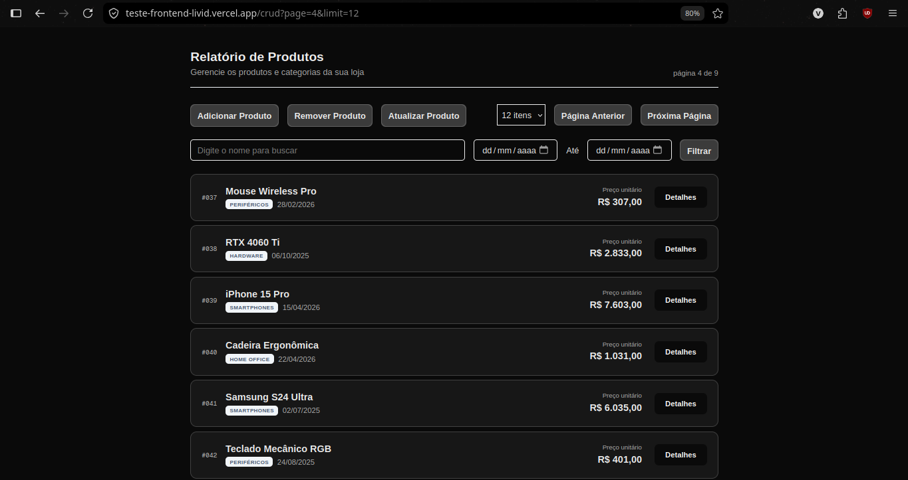
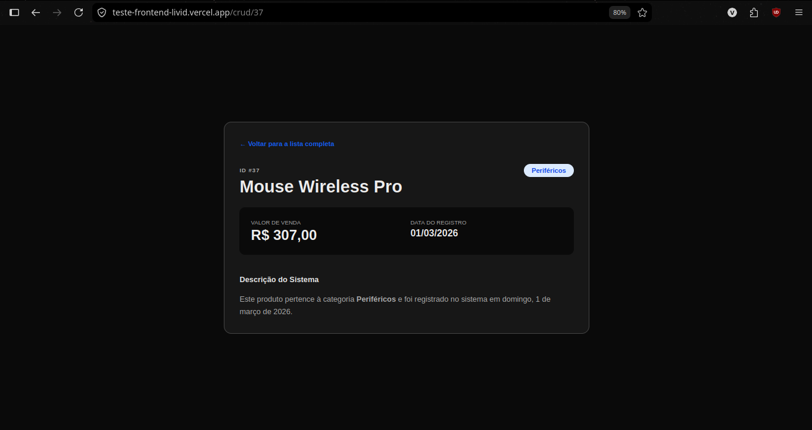

# Teste Frontend

Aplicacao frontend em `Next.js` com autenticacao via Firebase, dashboard com graficos e fluxo de CRUD de produtos.

## Instrucoes para rodar o projeto

### 1) Pre-requisitos

- Node.js 20+ (recomendado)
- npm (ou outro gerenciador compativel)

### 2) Instalar dependencias

```bash
npm install

```

### 3) Configurar variaveis de ambiente

Crie um arquivo `.env.local` na raiz do projeto com as variaveis:

```env
NEXT_PUBLIC_FIREBASE_API_KEY=
NEXT_PUBLIC_FIREBASE_AUTH_DOMAIN=
NEXT_PUBLIC_FIREBASE_PROJECT_ID=
NEXT_PUBLIC_FIREBASE_STORAGE_BUCKET=
NEXT_PUBLIC_FIREBASE_MESSAGING_SENDER_ID=
NEXT_PUBLIC_FIREBASE_APP_ID=

```

### 4) Rodar em desenvolvimento

```bash
npm run dev

```

A aplicacao fica disponivel em [http://localhost:3000](http://localhost:3000).

### 5) Build de producao

```bash
npm run build
npm run start

```

## Tecnologias utilizadas

- `Next.js 16` com `App Router`
- `React 19` + `TypeScript`
- `Tailwind CSS 4` para estilos
- `Firebase Authentication` para login/cadastro
- `Zustand` para gerenciamento de estado global com persistencia
- `React Hook Form` + `Zod` para formularios e validacao
- `Recharts` para visualizacao de dados no dashboard
- `ESLint` para padrao e qualidade de codigo

## Decisoes tecnicas

- **Arquitetura por camadas de componentes:** separacao em `atoms`, `molecules`, `organisms` e `templates` para facilitar reutilizacao e manutencao de UI.
- **Roteamento com App Router:** paginas organizadas em `app/` (ex.: `login`, `register`, `dashboard` e `crud`) seguindo o padrao moderno do Next.js.
- **Autenticacao com Firebase + cookie HTTP-only:** usuario autentica no Firebase e o token e salvo em cookie no servidor via server actions (`services/auth.ts`) para melhorar seguranca.
- **Estado global persistido:** uso de `zustand/middleware` com `localStorage` para manter sessao de autenticacao entre recarregamentos.
- **Validacao declarativa de formularios:** regras centralizadas em schemas `Zod` (`schemas/`) e integradas ao `React Hook Form`.
- **Dados desacoplados da UI:** dados de exemplo isolados em `data/`, permitindo evolucao para consumo de API sem acoplamento forte aos componentes.

## Screenshots











